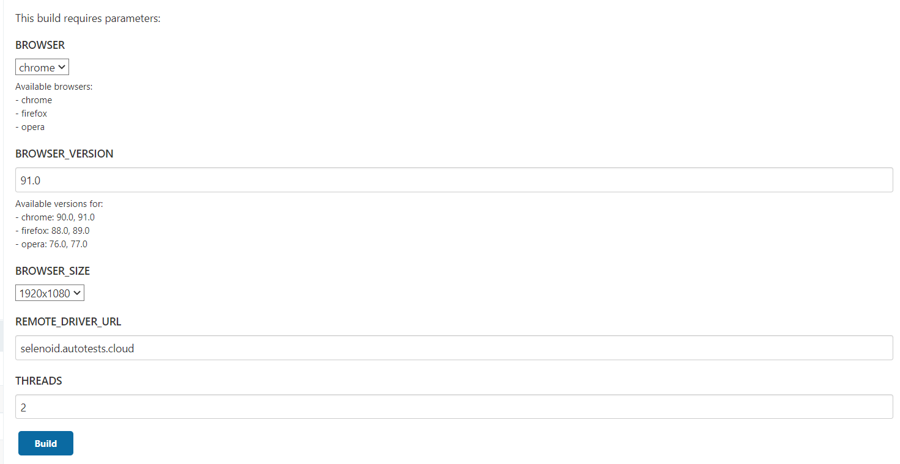
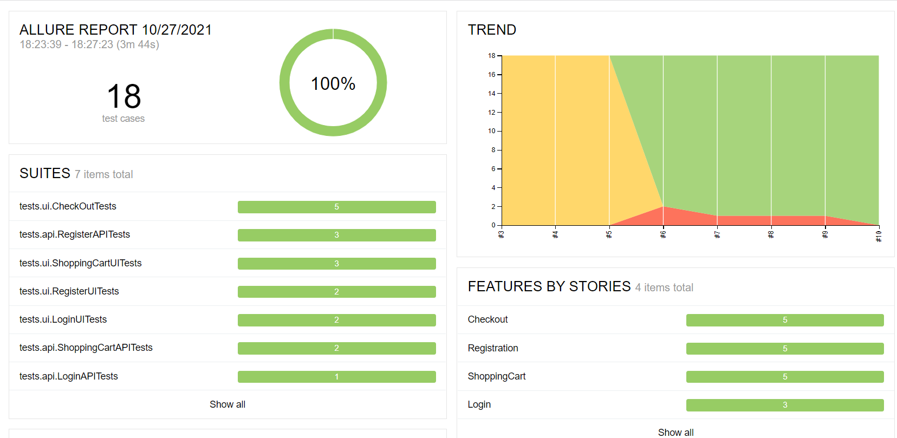
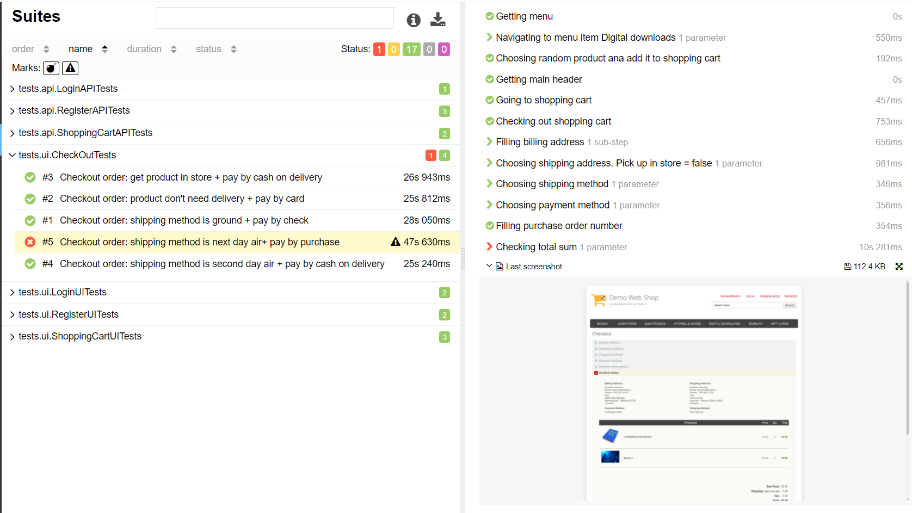
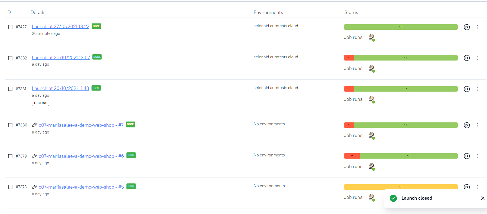
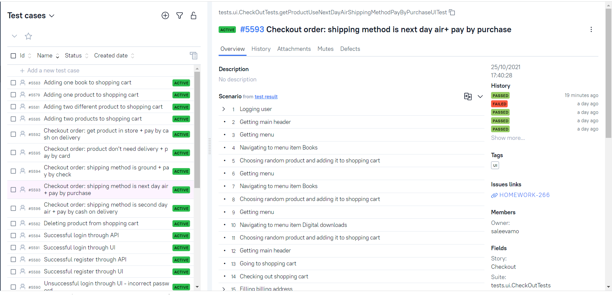
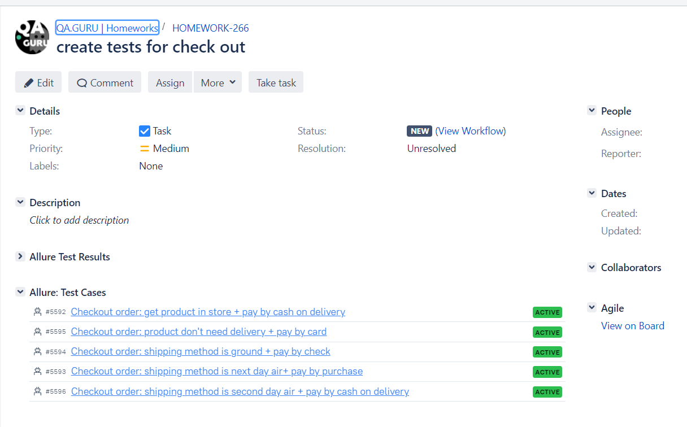
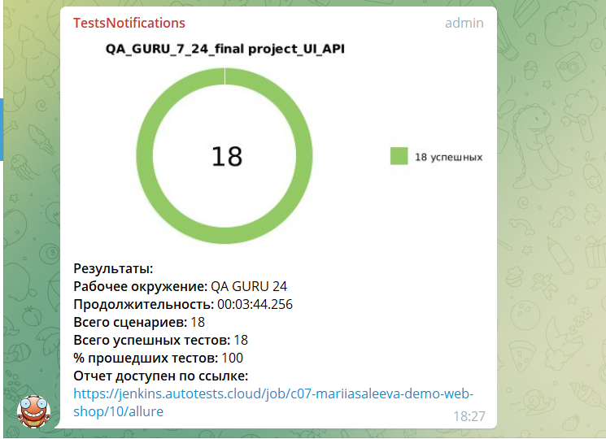

# Autotests for http://demowebshop.tricentis.com/

## Covered features:

- [x] API + UI users registration
- [x] API + UI users login
- [x] API + UI add products to shopping cart
- [x] UI check out shopping cart

## Technology Stack:


Java, Gradle, JUnit5, Selenide, Rest-Assured, Jenkins, Selenoid, Allure Reports, Telegram (уведомления), Jira, TestOps

## Description

You can run tests by configuring the following parameters:

- BROWSER
- BROWSER_VERSION
- BROWSER_SIZE
- REMOTE_DRIVER_URL
- THREADS
  

### To run tests locally with files app.properties and local.properties:

```
gradle clean test 
```

## Allure reports

### Overview



### Test with steps, attached image, console logs



### Video


## Allure TestOps

## Launches



## Test Cases



## Jira integration



## Telegram report




